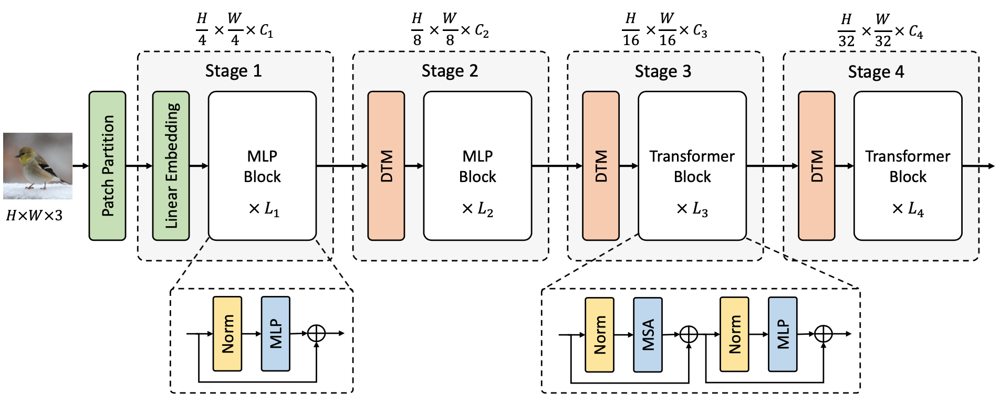

# Less is More: Pay Less Attention in Vision Transformers

Official PyTorch implementation of **Less is More: Pay Less Attention in Vision Transformers**.

By [Zizheng Pan](https://scholar.google.com.au/citations?user=w_VMopoAAAAJ&hl=en), [Bohan Zhuang](https://sites.google.com/view/bohanzhuang), [Haoyu He](https://scholar.google.com/citations?user=aU1zMhUAAAAJ&hl=en), [Jing Liu](https://sites.google.com/view/jing-liu/%E9%A6%96%E9%A1%B5), [Jianfei Cai](https://scholar.google.com/citations?user=N6czCoUAAAAJ&hl=en)





In our [paper](https://arxiv.org/abs/2105.14217), we present a novel Less attention vIsion Transformer (LIT), building upon the fact that convolutions, fully-connected (FC) layers, and self-attentions have almost equivalent mathematical expressions for processing image patch sequences. LIT uses pure multi-layer perceptrons (MLPs) to encode rich local patterns in the early stages while applying self-attention modules to capture longer dependencies in deeper layers. Moreover, we further propose a learned deformable token merging module to adaptively fuse informative patches in a non-uniform manner.


If you use this code for a paper please cite:

```
@article{pan2021less,
  title={Less is More: Pay Less Attention in Vision Transformers},
  author={Pan, Zizheng and Zhuang, Bohan and He, Haoyu and Liu, Jing and Cai, Jianfei},
  journal={arXiv preprint arXiv:2105.14217},
  year={2021}
}
```


## Usage

First, clone this repository.

```bash
git clone https://github.com/MonashAI/LIT
```

Next, create a conda virtual environment.

```bash
# Make sure you have a NVIDIA GPU.
cd LIT/
bash setup_env.sh [conda_install_path] [env_name]

# For example
bash setup_env.sh /home/anaconda3 lit
```

**Note:** We use PyTorch 1.7.1 with CUDA 10.1 for all experiments. The `setup_env.sh` has illustrated all dependencies we used in our experiments. You may want to edit this file to install a different version of PyTorch or any other packages.


## Data Preparation

Download the ImageNet 2012 dataset from [here](http://image-net.org/), and prepare the dataset based on this [script](https://gist.github.com/BIGBALLON/8a71d225eff18d88e469e6ea9b39cef4). The file structure should look like:

```bash
imagenet
├── train
│   ├── class1
│   │   ├── img1.jpeg
│   │   ├── img2.jpeg
│   │   └── ...
│   ├── class2
│   │   ├── img3.jpeg
│   │   └── ...
│   └── ...
└── val
    ├── class1
    │   ├── img4.jpeg
    │   ├── img5.jpeg
    │   └── ...
    ├── class2
    │   ├── img6.jpeg
    │   └── ...
    └── ...
```


## Model Zoo

We provide baseline LIT models pretrained on ImageNet 2012.

| Model  | Params (M) | FLOPs (G) | Top-1 Acc. (%) | Model                                                        | Log                                                          |
| ------ | ---------- | --------- | -------------- | ------------------------------------------------------------ | ------------------------------------------------------------ |
| LIT-Ti | 19         | 3.6       | 81.1           | [google drive](https://drive.google.com/file/d/19X3u-0BtXXZRlWZeSe5e-Z0ocS6rWCFb/view?usp=sharing)/[github](https://github.com/MonashAI/LIT/releases/download/v1.0/lit_ti.pth) | [log](https://github.com/MonashAI/LIT/releases/download/v1.0/log_lit_ti.txt) |
| LIT-S  | 27         | 4.1       | 81.5           | [google drive](https://drive.google.com/file/d/1WbXspSpUFmiFEeJov4LNWEOLlgUO6eKs/view?usp=sharing)/[github](https://github.com/MonashAI/LIT/releases/download/v1.0/lit_s.pth) | [log](https://github.com/MonashAI/LIT/releases/download/v1.0/log_rank0_lit_small.txt) |
| LIT-M  | 48         | 8.6       | 83.0           | [google drive](https://drive.google.com/file/d/1HYJLmKSYO5rgGWPynzEMEG_TYEqFA0oy/view?usp=sharing)/[github](https://github.com/MonashAI/LIT/releases/download/v1.0/lit_m.pth) | [log](https://github.com/MonashAI/LIT/releases/download/v1.0/log_rank0_lit_medium.txt) |
| LIT-B  | 86         | 15.0      | 83.4           | [google drive](https://drive.google.com/file/d/1EX2CbCVUbc3IVFWdlnRoh7GBWov91iXb/view?usp=sharing)/[github](https://github.com/MonashAI/LIT/releases/download/v1.0/lit_b.pth) | [log](https://github.com/MonashAI/LIT/releases/download/v1.0/log_rank0_lit_base.txt) |


## Training and Evaluation

In our implementation, we have different training strategies for LIT-Ti and other LIT models. Therefore, we provide two codebases. 

For LIT-Ti, please refer to [code_for_lit_ti](https://github.com/MonashAI/LIT/tree/main/code_for_lit_ti).

For LIT-S, LIT-M, LIT-B, please refer to [code_for_lit_s_m_b](https://github.com/MonashAI/LIT/tree/main/code_for_lit_s_m_b).


## License

This repository is released under the Apache 2.0 license as found in the [LICENSE](https://github.com/MonashAI/LIT/blob/main/LICENSE) file.


## Acknowledgement

This repository has adopted codes from [DeiT](https://github.com/facebookresearch/deit), [PVT](https://github.com/whai362/PVT) and [Swin](https://github.com/microsoft/Swin-Transformer), we thank the authors for their open-sourced code.

